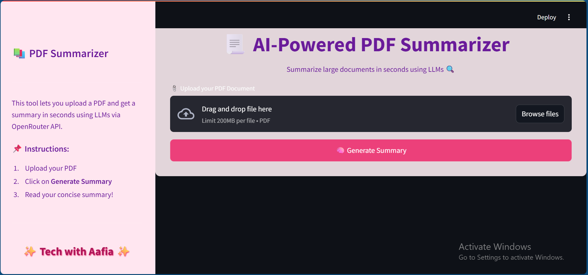

# PDF Summarizer App 📄✨

This is a **PDF summarizer web app** built using `Streamlit` and OpenRouter’s API with support for **Claude, Mistral, and LLaMA** models.

### 🌟 Features

- 🔍 Upload and summarize PDF files using LLMs.
- 💬 Choose your preferred model: Claude, Mistral, or LLaMA.
- 🎨 Beautiful pink-themed UI with image background and custom sidebar.
- 📂 Drag & Drop PDF functionality.
- ⚡ Powered by OpenRouter API (Free & Paid models).

---

### 🖥️ Tech Stack

- `Python`
- `Streamlit`
- `Langchain`
- `OpenRouter API`
- `PDFplumber` (or PyMuPDF)
- `Git & GitHub`

---

### 🚀 How to Run Locally

1. **Clone the repository:**

```bash
git clone https://github.com/YourUsername/pdf-summarizer-app.git
cd pdf-summarizer-app


### 📦 Install Dependencies

Make sure you have Python installed (preferably version 3.9+), then run the following command in your terminal:

```bash
pip install -r requirements.txt

### Run the app

streamlit run test.py

###🔐 API Key Setup
You must get an OpenRouter API key from openrouter.ai and set it as:

export OPENROUTER_API_KEY=your_key_here


###📸 UI Snapshot


###🤝 Contributing
Pull requests and improvements are welcome! 😊

🧕 Made with 📃👨‍💻 by Aafia 